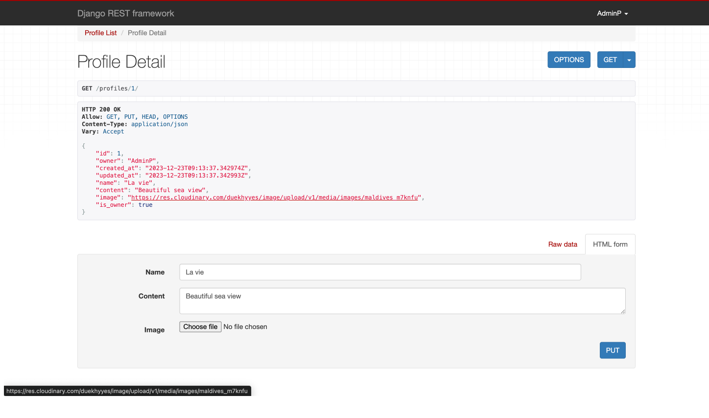
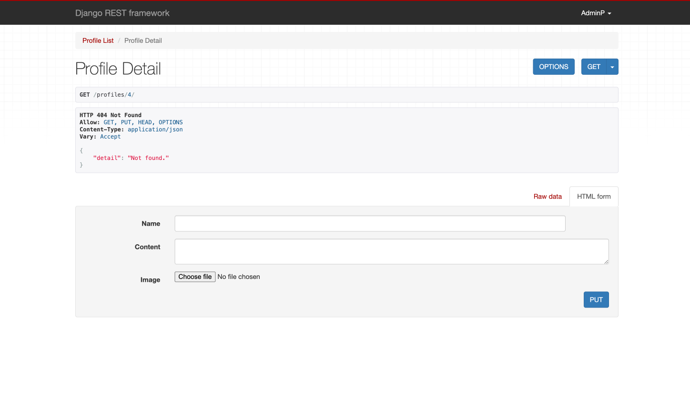

# Hidden wonders API Manual Testing
### Overview of Hidden Wonders API

The Hidden Wonders API is a robust digital platform designed for an interactive blogging community. This API serves as the backbone of a dynamic web application where users can engage with a wide range of content through blog posts, comments, likes, and followers. It's tailored to offer both social interaction and informational content sharing.

## Key Features
- **Blog Posts Management:** Users can create, view, edit, and delete blog posts. This feature is central to the platform, fostering a vibrant community of content creators and readers.
- **Comments System:** The API supports a comments feature, enabling users to engage in discussions on blog posts, enhancing the interactivity of the platform.
- **Likes and Followers Functionality:** Users can like posts and follow other users, adding a social networking dimension to the platform.
- **Profile Management:** Users can create and edit their profiles, adding a personal touch to their interactions on the platform.
- **Categories System:** The API categorizes posts, allowing for easier navigation and a more organized content structure.

## Security and Accessibility
- **User Authentication:** The API enforces user authentication for creating and interacting with content, ensuring a secure and personalized experience.
- **Administrator Controls:** Special privileges are granted to administrators for content moderation, vital for maintaining the quality and appropriateness of the content.

## Intended Use
The Hidden Wonders API is intended for use in a blogging application where content creation, sharing, and community interaction are key components. It aims to provide an intuitive and engaging user experience, ensuring both content creators and readers find value and connectivity on the platform.

By combining these features, the Hidden Wonders API aims to create a comprehensive and engaging online community, connecting users through shared interests and interactive content.

### Methodology
The approach I adopted for manually evaluating each endpoint involved inserting new data into every legitimate endpoint to observe its reaction. Subsequently, I inputted invalid data to determine if it would trigger appropriate error messages and codes. These evaluations were conducted using the Django Rest Framework HTML interface.

The API's primary function is to permit only authenticated users to create blog posts and to interact with these posts through likes, follows, and comments. Conversely, unauthenticated users are limited to merely viewing these posts, without the capability to interact in any manner. Access to this content is possible through the homepage, utilizing the search bar, or by navigating the categories dropdown menu. This design ensures that all visitors can peruse the site's content, even without a user profile, but they are restricted from creating posts or engaging with existing ones.

Thus, the functionality is such that only users who are logged in can create, modify, or remove posts, comments, likes, and followers. Additionally, authenticated users have the privilege to update their profiles, including details like username, password, biography, and profile picture. For an unauthenticated user, these functionalities should be inaccessible, which was a focus of my testing.

Furthermore, I integrated a feature that allows me, as an administrator, to delete posts and comments. This was implemented to eliminate any potential inappropriate or offensive content that might be uploaded to the site in the form of posts or comments. This aspect was also scrutinized during the testing phase.

### Profiles Endpoint
- api/profiles/
     - Test Scenarios.

     Regarding the endpoint for user profile details, it's designed so that only the profile's owner can modify specific details, like their username. In the accompanying image, you'll see how I conducted a test using the PUT method by inputting extra data into the content field. This was to ensure that the update functionality is restricted to the profile owner only.

     

  ### api/profiles/id/
     - Test Scenarios and Expected Results.

     This worked as intended.
     When I attempt to enter an invalid ID, I am shown a 404 error with the message Not Found. This can be seen below.

     

4. **Posts Endpoints**
   - api/posts/
     - Test Scenarios and Expected Results
   - api/posts/id/
     - Test Scenarios and Expected Results

5. **Comments Endpoints**
   - api/comments/
     - Test Scenarios and Expected Results
   - api/comments/id/
     - Test Scenarios and Expected Results

6. **Likes Endpoints**
   - api/likes/
     - Test Scenarios and Expected Results
   - api/likes/id/
     - Test Scenarios and Expected Results

7. **Followers Endpoints**
   - api/followers/
     - Test Scenarios and Expected Results
   - api/followers/id/
     - Test Scenarios and Expected Results

8. **Categories Endpoints**
   - api/category/
     - Test Scenarios and Expected Results

9. **Conclusion**
   - Summary of Findings
   - Recommendations for Improvement